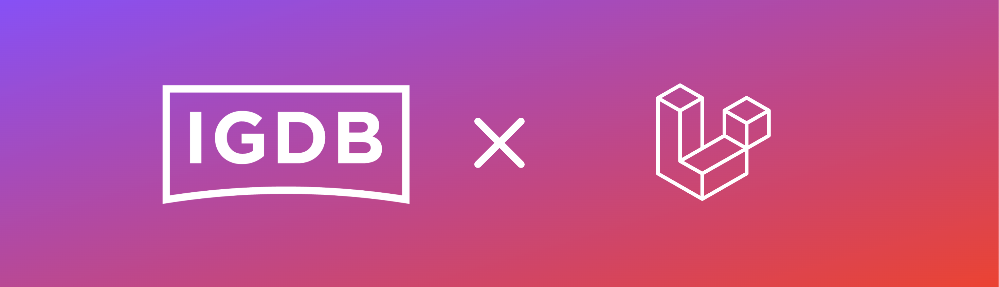

# Introduction

{.inline-images}
[](https://github.com/marcreichel/igdb-laravel/actions/workflows/tests.yml)
[](https://github.com/marcreichel/igdb-laravel/actions/workflows/code-quality.yml)
[](https://www.codefactor.io/repository/github/marcreichel/igdb-laravel)
[](https://packagist.org/packages/marcreichel/igdb-laravel)
[](https://packagist.org/packages/marcreichel/igdb-laravel)
[](https://packagist.org/packages/marcreichel/igdb-laravel)
[](https://gitmoji.dev)

{style="width: 100%"}

This is a Laravel wrapper for version 4 of the [IGDB API](https://api-docs.igdb.com/) (Apicalypse) including [webhook handling](90-webhooks.md) since version 2.3.0.

It handles authentication and caching of the IGDB API automatically.

## Example

```php
// torchlight! {"lineNumbers": false}
use MarcReichel\IGDBLaravel\Models\Game;

$game = Game::where('name', 'Fortnite')->first();
```
